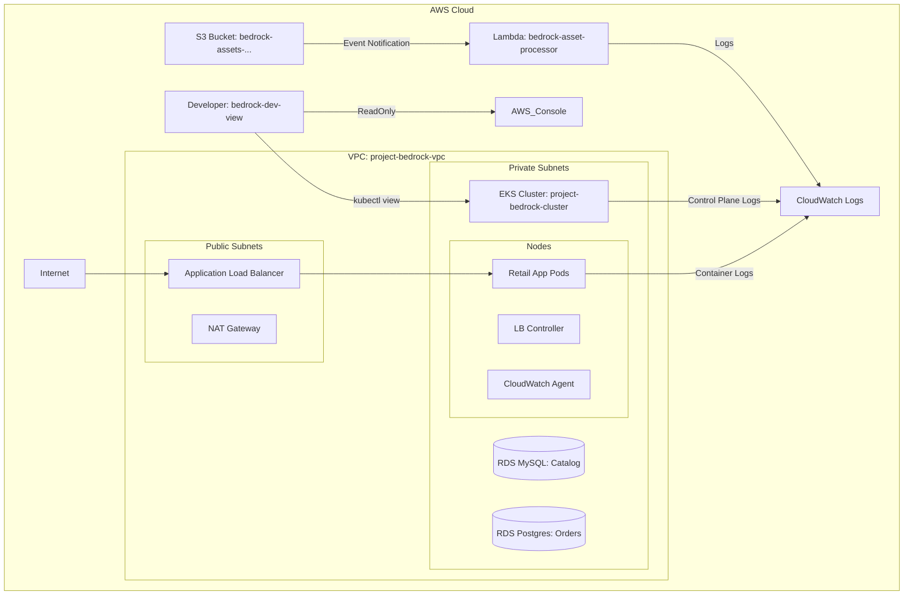

# Project Bedrock Architecture

```mermaid
graph TD
    subgraph AWS Cloud
        subgraph VPC [VPC: project-bedrock-vpc]
            subgraph Public Subnets
                NAT[NAT Gateway]
                ALB[Application Load Balancer]
            end
            
            subgraph Private Subnets
                EKS[EKS Cluster: project-bedrock-cluster]
                subgraph Nodes
                    Pod[Retail App Pods]
                    LBC[LB Controller]
                    CW[CloudWatch Agent]
                end
                RDS_MySQL[(RDS MySQL: Catalog)]
                RDS_PG[(RDS Postgres: Orders)]
            end
        end
        
        S3[S3 Bucket: bedrock-assets-...] -->|Event Notification| Lambda[Lambda: bedrock-asset-processor]
        Lambda -->|Logs| CW_Logs[CloudWatch Logs]
        
        EKS -->|Control Plane Logs| CW_Logs
        Pod -->|Container Logs| CW_Logs
        
        User[Developer: bedrock-dev-view] -->|ReadOnly| AWS_Console
        User -->|kubectl view| EKS
        
        Internet --> ALB --> Pod
    end
```
