# Application Architecture

The application is intentionally designed with many loosely coupled components. Each component has its own infrastructure requirements and can work with different backend options (for example, the Carts service supports MongoDB or DynamoDB).


In the diagram:

### ✔ **Catalog → MySQL**

Stores products

(name, price, description)

### ✔ **Cart → DynamoDB**

Stores items user added to cart

(userId, productId, quantity)

### ✔ **Checkout → Redis**

Stores short-lived session data

(checkout session, temporary cart data)

### ✔ **Orders → PostgreSQL**

Stores final order details

(orderId, amount, items, userId)

### ✔ **Arrow from Checkout → Orders**

Means: after user pays → create an order in the **orders** database.

### ✔ **Dotted Arrow to RabbitMQ / SQS**

Means: *optionally* send a message

“Order #387 created — process shipping”.

This dotted arrow represents **asynchronous processing** (background processing).

| **Component** | **Language** | **Container Image** | **Helm Chart** | **Description** |
| --- | --- | --- | --- | --- |
| [UI](https://github.com/aws-containers/retail-store-sample-app/blob/main/src/ui) | Java | [Link](https://gallery.ecr.aws/aws-containers/retail-store-sample-ui) | [Link](https://gallery.ecr.aws/aws-containers/retail-store-sample-ui-chart) | Store user interface |
| [Catalog](https://github.com/aws-containers/retail-store-sample-app/blob/main/src/catalog) | Go | [Link](https://gallery.ecr.aws/aws-containers/retail-store-sample-catalog) | [Link](https://gallery.ecr.aws/aws-containers/retail-store-sample-catalog-chart) | Product catalog API |
| [Cart](https://github.com/aws-containers/retail-store-sample-app/blob/main/src/cart) | Java | [Link](https://gallery.ecr.aws/aws-containers/retail-store-sample-cart) | [Link](https://gallery.ecr.aws/aws-containers/retail-store-sample-cart-chart) | User shopping carts API |
| [Orders](https://github.com/aws-containers/retail-store-sample-app/blob/main/src/orders) | Java | [Link](https://gallery.ecr.aws/aws-containers/retail-store-sample-orders) | [Link](https://gallery.ecr.aws/aws-containers/retail-store-sample-orders-chart) | User orders API |
| [Checkout](https://github.com/aws-containers/retail-store-sample-app/blob/main/src/checkout) | Node | [Link](https://gallery.ecr.aws/aws-containers/retail-store-sample-checkout) | [Link](https://gallery.ecr.aws/aws-containers/retail-store-sample-checkout-chart) | API to orchestrate the checkout process |

# Overview

## Architecture Diagram:

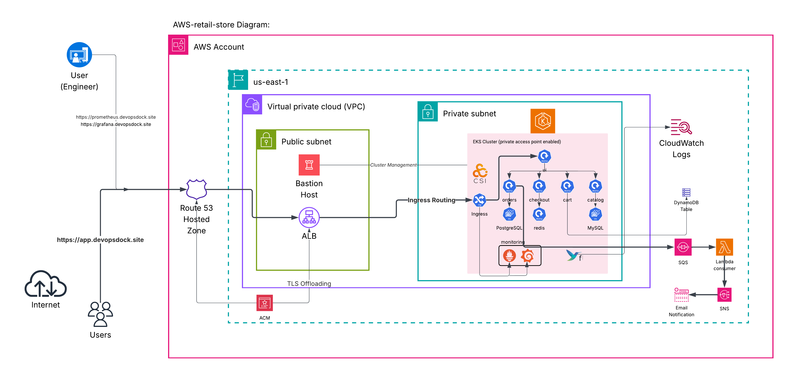

In this project, we are going to deploy the complete **AWS Retail Store Sample App**, which is a microservices-based retail application. We will build everything from the ground up, starting with AWS networking, then deploying an EKS cluster, then configuring databases, messaging, logging, monitoring, and secure access.

- We will begin by creating a fully isolated **VPC architecture** that includes public and private subnets, an Internet Gateway, a NAT Gateway, proper routing tables, and all networking requirements for running workloads securely.
- Next, we will create an **EKS cluster** inside the private subnets with **private API endpoint access**, ensuring that both the control plane and worker nodes stay inside the private network. A **node group** will also be deployed in the private subnets.
- To access the private cluster securely, we will deploy a **bastion host** in the public subnet and install AWS CLI, kubectl, eksctl, and Helm on it. All cluster operations will be performed from this bastion host.
- After the cluster is ready, we will deploy all microservices of the application. These services will make use of different AWS-managed databases:
    - **DynamoDB** for the carts service
    - **MySQL** for the product catalog
    - **PostgreSQL** for orders
    - **Redis** for checkout
- The application’s frontend UI will be exposed to the internet using the **AWS Load Balancer Controller**, which will create an **Application Load Balancer (ALB)**. All API calls from the UI will be handled server side within the private network.
- For asynchronous event processing, we will integrate **Amazon SQS** as the message queue, with a **Lambda function** acting as the consumer. The processed messages will trigger notifications sent through **Amazon SNS**.
- We will secure all Kubernetes service accounts using **IAM Roles for Service Accounts (IRSA)** to ensure fine-grained permissions without exposing credentials.
- For stateful components, we will use the **EBS CSI driver** to dynamically provision persistent storage volumes.
- We will implement centralized logging with **Fluent Bit and CloudWatch Logs**, allowing us to collect logs from all microservices and system components.
- For monitoring and observability, we will deploy **Prometheus and Grafana** using Helm charts. Both will be exposed through the same load balancer using **multi-path ingress rules**.
- To secure external communication, we will configure **TLS/SSL on the ALB**, and all endpoints will be accessed using a **custom Route 53 domain** for clean and professional DNS management.

By the end of the project, we will have a fully functional, secure, scalable, and production-grade microservices application running on AWS using EKS and several managed services.

# Setup Steps

## **Create VPC**

```bash
VPC_ID=$(aws ec2 create-vpc \
  --cidr-block 10.10.0.0/16 \
  --query 'Vpc.VpcId' \
  --output text)

aws ec2 create-tags --resources $VPC_ID --tags Key=Name,Value=e-com-vpc
echo "VPC_ID=$VPC_ID"

```

---

## **Create Subnets (2 Public + 2 Private)**

```bash
PUB1=$(aws ec2 create-subnet \
  --vpc-id $VPC_ID \
  --cidr-block 10.10.1.0/24 \
  --availability-zone us-east-1a \
  --query 'Subnet.SubnetId' \
  --output text)

PUB2=$(aws ec2 create-subnet \
  --vpc-id $VPC_ID \
  --cidr-block 10.10.2.0/24 \
  --availability-zone us-east-1b \
  --query 'Subnet.SubnetId' \
  --output text)

PRI1=$(aws ec2 create-subnet \
  --vpc-id $VPC_ID \
  --cidr-block 10.10.11.0/24 \
  --availability-zone us-east-1a \
  --query 'Subnet.SubnetId' \
  --output text)

PRI2=$(aws ec2 create-subnet \
  --vpc-id $VPC_ID \
  --cidr-block 10.10.12.0/24 \
  --availability-zone us-east-1b \
  --query 'Subnet.SubnetId' \
  --output text)

```

### **Tag Subnets**

```bash
aws ec2 create-tags --resources $PUB1 --tags Key=Name,Value=pub-subnet-1a
aws ec2 create-tags --resources $PUB2 --tags Key=Name,Value=pub-subnet-1b
aws ec2 create-tags --resources $PRI1 --tags Key=Name,Value=pri-subnet-1a
aws ec2 create-tags --resources $PRI2 --tags Key=Name,Value=pri-subnet-1b

```

---

## **Create & Attach Internet Gateway**

```bash
IGW_ID=$(aws ec2 create-internet-gateway \
  --query 'InternetGateway.InternetGatewayId' \
  --output text)

aws ec2 attach-internet-gateway \
  --internet-gateway-id $IGW_ID \
  --vpc-id $VPC_ID

aws ec2 create-tags --resources $IGW_ID --tags Key=Name,Value=petclinic-igw
```

---

## **Create Public Route Table + Route + Associations**

```bash
RTB_PUB=$(aws ec2 create-route-table \
  --vpc-id $VPC_ID \
  --query 'RouteTable.RouteTableId' \
  --output text)

aws ec2 create-tags --resources $RTB_PUB --tags Key=Name,Value=public-rt
```

### **Add route to Internet**

```bash
aws ec2 create-route \
  --route-table-id $RTB_PUB \
  --destination-cidr-block 0.0.0.0/0 \
  --gateway-id $IGW_ID
```

### **Associate public subnets**

```bash
aws ec2 associate-route-table --route-table-id $RTB_PUB --subnet-id $PUB1
aws ec2 associate-route-table --route-table-id $RTB_PUB --subnet-id $PUB2
```

## **Allocate Elastic IP**

```bash
EIP_ALLOC=$(aws ec2 allocate-address \
  --domain vpc \
  --query 'AllocationId' \
  --output text)

echo "EIP_ALLOC=$EIP_ALLOC"
```

---

## **Create NAT Gateway in Public Subnet**

Use **PUB1** for NAT Gateway (best practice: place NAT in 1 AZ).

```bash
NAT_GW_ID=$(aws ec2 create-nat-gateway \
  --subnet-id $PUB1 \
  --allocation-id $EIP_ALLOC \
  --query 'NatGateway.NatGatewayId' \
  --output text)

echo "NAT_GW_ID=$NAT_GW_ID"
```

### **Wait for NAT Gateway to be available**

(Necessary before creating routes)

```bash
aws ec2 wait nat-gateway-available --nat-gateway-ids $NAT_GW_ID
```

---

## **Create Private Route Table**

```bash
RTB_PRI=$(aws ec2 create-route-table \
  --vpc-id $VPC_ID \
  --query 'RouteTable.RouteTableId' \
  --output text)

aws ec2 create-tags --resources $RTB_PRI --tags Key=Name,Value=private-rt

echo "RTB_PRI=$RTB_PRI"
```

---

## **Add Route for Outbound Internet via NAT**

```bash
aws ec2 create-route \
  --route-table-id $RTB_PRI \
  --destination-cidr-block 0.0.0.0/0 \
  --nat-gateway-id $NAT_GW_ID

```

---

## **Associate Private Subnets with Private Route Table**

```bash
aws ec2 associate-route-table --route-table-id $RTB_PRI --subnet-id $PRI1
aws ec2 associate-route-table --route-table-id $RTB_PRI --subnet-id $PRI2
```

## **Get your public IP dynamically**

```bash
MYIP=$(curl -s ifconfig.me)/32
echo "Your IP: $MYIP"
```

---

## **Create Security Group for Bastion Host**

Allows only **your IP** on SSH (port 22).

```bash
BASTION_SG=$(aws ec2 create-security-group \
  --group-name bastion-sg \
  --description "Security group for bastion host" \
  --vpc-id $VPC_ID \
  --query 'GroupId' \
  --output text)

aws ec2 create-tags --resources $BASTION_SG --tags Key=Name,Value=bastion-sg

echo "BASTION_SG=$BASTION_SG"
```

### **Add inbound rule for SSH from your IP**

```bash
aws ec2 authorize-security-group-ingress \
  --group-id $BASTION_SG \
  --protocol tcp \
  --port 22 \
  --cidr $MYIP
```

---

## **Create Key Pair (if you don’t have one)**

Store private key locally.

```bash
aws ec2 create-key-pair \
  --key-name bastion-key \
  --query 'KeyMaterial' \
  --output text > bastion-key.pem

chmod 400 bastion-key.pem

```

## **Dynamic Ubuntu AMI for us-east-1 (x86_64)**

```bash
AMI_ID=$(aws ec2 describe-images \
  --owners 099720109477 \
  --filters "Name=name,Values=ubuntu/images/hvm-ssd/ubuntu-jammy-22.04-amd64-server-*" \
            "Name=state,Values=available" \
  --query 'Images | sort_by(@, &CreationDate)[-1].ImageId' \
  --output text)

echo "AMI_ID=$AMI_ID"

```

✔ Owner **099720109477** = Official Canonical Ubuntu

✔ Latest Ubuntu 22.04 (Jammy)

✔ x86_64 (for t3.micro)

---

## **Launch Bastion Host (Ubuntu, t3.micro)**

Everything else remains exactly the same — only change is AMI.

```bash
BASTION_INSTANCE=$(aws ec2 run-instances \
  --image-id $AMI_ID \
  --instance-type t3.micro \
  --subnet-id $PUB1 \
  --security-group-ids $BASTION_SG \
  --key-name bastion-key \
  --associate-public-ip-address \
  --query 'Instances[0].InstanceId' \
  --output text)

aws ec2 create-tags --resources $BASTION_INSTANCE --tags Key=Name,Value=bastion-host

echo "BASTION_INSTANCE=$BASTION_INSTANCE"

```

---

## **SSH Command**

Once it is running:

```bash
ssh -i bastion-key.pem ubuntu@<PUBLIC-IP>

```

# **In the bastion host**

 **Install aws cli, eksctl, helm and kubectl.**

Refer to this linked documents to install the tools.

[**awscliv2**](https://docs.aws.amazon.com/cli/latest/userguide/getting-started-install.html)

[**eksctl**](https://docs.aws.amazon.com/eks/latest/eksctl/installation.html)

[**helm**](https://helm.sh/docs/intro/install/)

[**kubectl**](https://kubernetes.io/docs/tasks/tools/install-kubectl-linux/#install-using-native-package-management)

## **Set Required Environment Variables**

These environment variables will streamline the next steps:

```jsx
export AWS_REGION=us-east-1
export CLUSTER_NAME=microservice-ecom-eks
export AWS_ACCOUNT=$(aws sts get-caller-identity --query Account --output text)
VPC_ID=$(aws ec2 describe-vpcs --filters "Name=tag:Name,Values=eks-vpc" --query "Vpcs[0].VpcId" --output text)
```

## **Create the EKS Cluster Configuration**

Create a file named **cluster-private.yaml**, then paste the following configuration:

```jsx
apiVersion: eksctl.io/v1alpha5
kind: ClusterConfig

metadata:
  name: microservice-ecom-eks
  region: us-east-1
  version: "1.34"

vpc:
  id: vpc-0b5a32562515345b6 #Replace_your_VPC
  subnets:
    private:
      us-east-1a: { id: subnet-095e8da49879c0be3 } #Replace_private_subnets
      us-east-1b: { id: subnet-08b560ded6007ce69 }
  clusterEndpoints:
    privateAccess: true
    publicAccess: false

iam:
  withOIDC: true

managedNodeGroups:
  - name: ng-microservice
    instanceType: c7i-flex.large
    desiredCapacity: 2
    minSize: 2
    maxSize: 4
    privateNetworking: true
    ssh:
      allow: true
      publicKeyName: bastion-key
```

**Reference:**

[https://docs.aws.amazon.com/eks/latest/eksctl/general-nodegroups.html](https://docs.aws.amazon.com/eks/latest/eksctl/general-nodegroups.html)

## **Create the Private EKS Cluster**

Run the cluster creation command:

```bash
eksctl create cluster -f cluster-private.yaml
```

This configuration ensures:

- The cluster runs **entirely inside private subnets**
- Worker nodes are created privately with no public IP
- The EKS public endpoint is **disabled**
- The control plane is accessible only from inside the VPC (through bastion or VPN)
- OIDC is enabled for LBC, autoscaling, and CSI drivers
- Multi-AZ high availability is used

Cluster provisioning takes around **15–20 minutes**.

Add HTTPS access from the bastion host inside the **cluster security group** for API communication.

## **Install AWS Load Balancer Controller (LBC)**

**Step 1: Create IAM Role for the Controller**

Download the required IAM policy for LBC:

```bash
curl -O https://raw.githubusercontent.com/kubernetes-sigs/aws-load-balancer-controller/v2.14.1/docs/install/iam_policy.json
```

Create the IAM policy:

```bash
aws iam create-policy \
    --policy-name AWSLoadBalancerControllerIAMPolicy \
    --policy-document file://iam_policy.json
```

Create the service account with IAM role via eksctl:

```jsx
eksctl create iamserviceaccount \
    --cluster=$CLUSTER_NAME \
    --namespace=kube-system \
    --name=aws-load-balancer-controller \
    --attach-policy-arn=arn:aws:iam::$AWS_ACCOUNT:policy/AWSLoadBalancerControllerIAMPolicy \
    --role-name aws-load-balancer-controller \
    --override-existing-serviceaccounts \
    --region $AWS_REGION \
    --approve
```

**Step 2: Install AWS Load Balancer Controller**

Add the `eks-charts` Helm chart repository.

```jsx
helm repo add eks https://aws.github.io/eks-charts
```

Update your local repo to make sure that you have the most recent charts.

```jsx
helm repo update eks
```

Install the controller:

```jsx
helm install aws-load-balancer-controller eks/aws-load-balancer-controller \
  -n kube-system \
  --set clusterName=$CLUSTER_NAME \
  --set serviceAccount.create=false \
  --set serviceAccount.name=aws-load-balancer-controller \
  --set region=$AWS_REGION \
  --set vpcID=$VPC_ID
  --version 1.14.0
```

make sure its running

```jsx
kubectl get deployment -n kube-system aws-load-balancer-controller
```

## **Enable Persistent Storage with EBS CSI Driver**

In this project, persistent storage is required for stateful components such as **MySQL (catalog service)** and **PostgreSQL (orders service)**. To support dynamic provisioning of EBS volumes inside the cluster, we enable and configure the **EBS CSI Driver** via EKS Addons.

**Step 1: Create an IAM role**

```bash
eksctl create iamserviceaccount \
        --name ebs-csi-controller-sa \
        --namespace kube-system \
        --cluster $CLUSTER_NAME \
        --role-name AmazonEKS_EBS_CSI_DriverRole \
        --role-only \
        --attach-policy-arn arn:aws:iam::aws:policy/service-role/AmazonEBSCSIDriverPolicy \
        --approve
```

**Step 2: Check Available Addons for Your Kubernetes Version**

This command helps you view the EKS-supported addons for the Kubernetes version you are running.

```bash
eksctl utils describe-addon-versions --kubernetes-version 1.34 | grep AddonName
```

**Step 3: Install the EBS CSI Driver Addon**

Copy the IAM role ARN from the console and replace it in the command below:

```bash
aws eks create-addon --cluster-name $CLUSTER_NAME --addon-name aws-ebs-csi-driver \
  --service-account-role-arn arn:aws:iam::229811873727:role/AmazonEKS_EBS_CSI_DriverRole \
  --configuration-values '{"defaultStorageClass":{"enabled":true}}'
```

## **Verify the Deployment**

The addon deploys the required components automatically, including a **DaemonSet** that ensures EBS CSI pods are running on each node:

```bash
kubectl get daemonset ebs-csi-node -n kube-system

NAME           DESIRED   CURRENT   READY   UP-TO-DATE   AVAILABLE   NODE SELECTOR            AGE
ebs-csi-node   2         2         0       2            0           kubernetes.io/os=linux   5s

```

Starting with EKS 1.30, the EBS CSI Driver use a default StorageClass object configured using Amazon EBS GP3 volume type. Run the following command to confirm:

```bash
kubectl get storageclass

NAME                           PROVISIONER             RECLAIMPOLICY   VOLUMEBINDINGMODE      ALLOWVOLUMEEXPANSION   AGE
ebs-csi-default-sc (default)   ebs.csi.aws.com         Delete          WaitForFirstConsumer   true                   101s
gp2                            kubernetes.io/aws-ebs   Delete          WaitForFirstConsumer   false                  3d

```

You can also view the addon inside the **EKS Console → Addons** section.

## **Usage in the Project**

This persistent storage will be attached automatically whenever MySQL or PostgreSQL pods request a PersistentVolumeClaim. This ensures durable, reliable storage for:

- **Catalog service (MySQL)**
- **Orders service (PostgreSQL)**

# Deploy app through helm.

# **`Catalog:`**

**Language:** Go

**Persistence:** MySQL

The Catalog service exposes APIs to retrieve product information and stores the data in MySQL.

<aside>
💡

### Optional Steps

Pull it with Helm (optional):

```bash
helm pull oci://public.ecr.aws/aws-containers/retail-store-sample-catalog-chart   --version 1.3.0
```

This downloads a file:

```
retail-store-sample-catalog-chart-1.3.0.tgz
```

Install:

```bash
helm install catalog \
  retail-store-sample-catalog-chart-1.3.0.tgz \
  -n catalog
```

---

📌 **4. Verify deployment**

```bash
kubectl get all -n catalog
```

</aside>

to get the values and store in it a file.

```jsx
helm show values oci://public.ecr.aws/aws-containers/retail-store-sample-catalog-chart --version 1.3.0 >helm-values/catalog-values.yaml
```

Create a directory for Helm values:

```bash
mkdir helm-values
```

Now open **catalog-values.yaml** and enable MySQL:

- Switch persistence from in-memory → MySQL
- Configure persistent volumes so EBS CSI driver can provision storage
- Enable internal MySQL StatefulSet that the chart deploys

```bash
app:
  persistence:
    provider: mysql
    endpoint: ""
    database: "catalog"
    
mysql:
  create: true
  
  persistentVolume:
    enabled: true
    annotations: {}
    labels: {}
    accessModes:
      - ReadWriteOnce
    size: 10Gi
    storageClass: "ebs-csi-default-sc"
```

Deploy the updated chart

```jsx
helm upgrade -i catalog \
  oci://public.ecr.aws/aws-containers/retail-store-sample-catalog-chart \
  -n catalog \
  -f catalog-values.yaml \
  --version 1.3.0
```

Check pods:

```bash
kubectl get po -n catalog
```

Check dynamically created EBS volumes:

```bash
kubectl get pv
```

<aside>
💡

# PVC/PV behavior in StatefulSets

When you delete a StatefulSet **pod**, the **PVC and PV remain**.

This is **expected** because:

- StatefulSet uses **Persistent Volume Claims (PVCs)**
- PVCs have a **storage class** with `reclaimPolicy: Delete`
- But deletion happens **only when you delete the PVC**, not the pod

Deleting a pod → **does not** delete PVC/PV

Deleting a PVC → PV deleted (because of `Delete` reclaim policy)

</aside>

# `Cart:`

**Language:** Java

**Persistence**: Amazon DynamoDB

The Cart service stores customer shopping carts using Amazon DynamoDB.

Create DynamoDB table

```jsx
aws dynamodb create-table \
  --table-name carts \
  --attribute-definitions \
      AttributeName=id,AttributeType=S \
      AttributeName=customerId,AttributeType=S \
  --key-schema \
      AttributeName=id,KeyType=HASH \
  --billing-mode PAY_PER_REQUEST \
  --global-secondary-indexes '[
    {
      "IndexName": "idx_global_customerId",
      "KeySchema": [
        { "AttributeName": "customerId", "KeyType": "HASH" }
      ],
      "Projection": { "ProjectionType": "ALL" }
    }
  ]'

```

Create IAM policy for DynamoDB access

```jsx
cat > carts-dynamo-policy.json <<EOF
{
  "Version": "2012-10-17",
  "Statement": [
    {
      "Sid": "AllAPIActionsOnCart",
      "Effect": "Allow",
      "Action": "dynamodb:*",
      "Resource": [
        "arn:aws:dynamodb:us-east-1:${AWS_ACCOUNT}:table/carts",
        "arn:aws:dynamodb:us-east-1:${AWS_ACCOUNT}:table/carts/index/*"
      ]
    }
  ]
}
EOF

```

Create the policy:

```jsx
aws iam create-policy \
  --policy-name carts-dynamo \
  --policy-document file://carts-dynamo-policy.json

```

Bind IRSA to Cart namespace

```jsx
eksctl create iamserviceaccount \
  --cluster microservice-ecom-eks \
  --namespace cart \
  --name cart \
  --attach-policy-arn arn:aws:iam::229811873727:policy/carts-dynamo \
  --role-name dynamo-table-access-for-carts \
  --approve \
  --override-existing-serviceaccounts

```

Check service account:

```jsx
kubectl get sa -n cart cart -o yaml

#verify this
# annotations:
#    eks.amazonaws.com/role-arn: arn:aws:iam::229811873727:role/eksctl-microservi#ce-ecom-eks-addon-iamservice-Role1-xVFwZ2JWpRwM

```

### **Retrieve chart values**

(Optional)

```bash
helm pull oci://public.ecr.aws/aws-containers/retail-store-sample-cart-chart --version 1.3.0
```

Retrieve values:

```bash
helm show values oci://public.ecr.aws/aws-containers/retail-store-sample-cart-chart --version 1.3.0 >helm-values/cart-values.yaml
```

Edit the file `vi helm-values/cart-values.yaml`

Modify:

- Reuse existing service account → `create: false`
- Map persistence provider to DynamoDB
- Provide table name

```bash
serviceAccount:
  # Specifies whether a service account should be created
  create: false
  # Annotations to add to the service account
  annotations: {}
  # The name of the service account to use.
  # If not set and create is true, a name is generated using the fullname templaeChange 2 of 4
  name: "cart"
  
app:
  persistence:
    provider: dynamodb
    dynamodb:
      tableName: carts
      createTable: false
```

Deploy:

```bash
helm upgrade -i cart \
  oci://public.ecr.aws/aws-containers/retail-store-sample-cart-chart \
  -n cart \
  -f helm-values/cart-values.yaml \
  --version 1.3.0
```

Check service account used by pod:

```bash
 kubectl get deploy cart-carts -n cart -o yaml | grep serviceAccount
      serviceAccount: cart-carts
      serviceAccountName: cart-carts
```

# `Orders:`

**Language**: Java

**Persistence:** PostgreSQL

The Orders service stores customer orders in PostgreSQL.

<aside>
⛔

This Order application *does NOT* include the AWS SDK SQS client dependency.

```bash
<dependency>
    <groupId>io.awspring.cloud</groupId>
    <artifactId>spring-cloud-aws-starter</artifactId>
</dependency>

<dependency>
    <groupId>io.awspring.cloud</groupId>
    <artifactId>spring-cloud-aws-starter-sqs</artifactId>
</dependency>
```

# Why this is required?

Spring Cloud AWS 3.x does **not** include AWS SDK clients automatically.

Our application code is calling AWS SQS via AWS SDK v2 underneath.

So without these dependencies:

- No SQS client will load
- No STS AssumeRoleWithWebIdentity will run
- No IRSA token exchange
- Result: **No messages sent to SQS and no AWS errors visible**

*Nothing goes to SQS even though IAM is correct. So i have added the dependency and build that image and pushed to dockerhub registry. Thatswhy i have separte custom image mentioned in the values file.*

Maybe the maintener missed this part.

I will include all the apps helm final helm values file at the end. You can take them as refernce and follow

</aside>

**Retrieve values**

```bash
helm show values oci://public.ecr.aws/aws-containers/retail-store-sample-orders-chart --version 1.3.0 >helm-values/orders-values.yaml
```

Modify:

- Set custom image
- Use PostgreSQL (not in-memory)
- Provide PostgreSQL service endpoint
- Enable SQS messaging
- Allow chart to create PostgreSQL StatefulSet
- Configure EBS-backed volumes

```bash
image:
  repository: laxg66/aws-retail-sample-app-orders
  pullPolicy: IfNotPresent
  tag: latest
  

app:
  persistence:
    provider: 'postgres'
    endpoint: orders-postgresql
    database: orders
    
messaging:
    provider: 'sqs'
    sqs:
      topic: "orders-events"
      

postgresql:
  create: true
 
  persistentVolume:
    enabled: true
    annotations: {}
    labels: {}
    accessModes:
      - ReadWriteOnce
    size: 10Gi
    storageClass: ebs-csi-default-sc
```

Deploy:

```bash
helm upgrade -i orders oci://public.ecr.aws/aws-containers/retail-store-sample-orders-chart -f helm-values/orders-values.yaml --version 1.3.0 -n orders
```

Check Pod

```bash
kubectl get po -n orders
```

Example logs:

```bash
2025-11-22T10:47:13.299Z  INFO 1 --- [nio-8080-exec-2] o.s.w.s.DispatcherServlet                : Completed initialization in 1 ms
OrderEntity [id=null, createdDate=null, shippingAddress=null, items=[OrderItemEntity [productId=a1258cd2-176c-4507-ade6-746dab5ad625, quantity=1, unitCost=0, totalCost=10000]]]
```

# `Checkout:`

**Language:** Node.js

**Persistence:** Redis

Checkout stores temporary checkout data in Redis and sends finalized orders to the Orders service.

Create namespace:

```bash
kubectl create ns checkout
```

Retrieve chart values:

```bash
helm show values oci://public.ecr.aws/aws-containers/retail-store-sample-checkout-chart --version 1.3.0 >helm-values/checkout-values.yaml
```

Modify:

- Use Redis as persistence
- Provide Orders API endpoint
- Enable embedded Redis deployment

Example:

```bash

app:
  persistence:
    provider: 'redis'
    redis:
      endpoint: ''

  endpoints:
    orders: 'http://orders.orders.svc.cluster.local:80'

redis:
  create: true
```

Deploy:

```bash
helm upgrade -i checkout oci://public.ecr.aws/aws-containers/retail-store-sample-checkout-chart --version 1.3.0 -f helm-values/checkout-values.yaml -n checkout
```

Check:

```bash
kubectl get po -n checkout
```

# `UI:`

**Language:** Java

**Persistence:** N/A

This service provides the frontend for the retail store, serving the HTML UI and aggregating calls to the backend API components.

Create namespace:

```bash
kubectl create ns ui
```

Retrieve values:

```bash
helm show values oci://public.ecr.aws/aws-containers/retail-store-sample-ui-chart --version 1.3.0 > helm-values/ui-values.yaml
```

Edit the file **`ui-values.yaml`** and:

- Configure the **backend endpoints** for all required services (catalog, orders, carts, checkout).
- Enable and configure **Ingress** for the UI service.
- Add the necessary **annotations** for an internet-facing AWS ALB, including target type, SSL redirect, listener ports, and the ACM certificate ARN.
- Specify the **Ingress host** that will route traffic to the UI through the ALB.

```bash
  endpoints:
    catalog: http://catalog.catalog.svc.cluster.local:80
    orders: http://orders.orders.svc.cluster.local:80
    carts: http://cart-carts.cart.svc.cluster.local:80
    checkout: http://checkout.checkout.svc.cluster.local:80
 
ingress:
  enabled: true
  className: "alb"
  annotations:
    alb.ingress.kubernetes.io/scheme: internet-facing
    alb.ingress.kubernetes.io/target-type: ip
    alb.ingress.kubernetes.io/healthcheck-path: /actuator/health/liveness
    alb.ingress.kubernetes.io/certificate-arn: arn:aws:acm:us-east-1:229811873727:certificate/2803e9ed-f705-4a08-a070-a5a523da7f28
    alb.ingress.kubernetes.io/group.name: ecom-eks
    alb.ingress.kubernetes.io/backend-protocol: HTTP
    alb.ingress.kubernetes.io/listen-ports: '[{"HTTP":80}, {"HTTPS":443}]'
    alb.ingress.kubernetes.io/ssl-redirect: '443'
  tls: []
  #  - secretName: chart-example-tls
  #    hosts:
  #      - chart-example.local
  hosts:
    - "chart-example.devopsdock.site"
```

Deploy:

```bash
helm upgrade -i ui oci://public.ecr.aws/aws-containers/retail-store-sample-ui-chart --version 1.3.0 -f helm-values/ui-values.yaml -n ui
```

Check:

```bash
kubectl get po -n ui
```

## **Verify the Application**

Add items to cart → verify in DynamoDB:

**DynamoDB Console → Tables → carts → Explore Items → Scan**

Similarly, you can validate the data inside the **catalog database**. Ensure that the persistence provider is set to **MySQL** in the Helm values file, then apply the upgrade and restart the service.

Optionally, inspect the deployment environment variables to confirm that the Helm chart has injected all configurations correctly.

```bash
 kubectl exec -it deploy/orders -n orders -- env | grep RETAIL
```

```bash
kubectl exec -it catalog-mysql-0 -n catalog -- sh
#In the sql shell fetch password form the secret and decode it. "echo "d1Vub2JLZGpUT0xQa3VMcQ==" | base64 --decode"
mysql -u catalog -p

SHOW DATABASES;
USE catalog;
SHOW TABLES;
DESCRIBE products;
SELECT * FROM products;

#verify the products in the UI.
```

```bash
kubectl exec -it orders-postgresql-0 -n orders -- sh
#in the pod shell
psql -U orders -d orders
\l #list dbs
\dt #list tables
SELECT * FROM orders;

#verify with order id from the UI.
```

# SQS Implementation

<aside>
📌

### 1️⃣ How SQS and SNS differ

- **SNS (Simple Notification Service)**: Push-based. It can send messages to multiple subscribers directly — email, SMS, Lambda, HTTP endpoints, SQS queues.
- **SQS (Simple Queue Service)**: Pull-based. Consumers (apps, Lambda, etc.) poll the queue to get messages. It **does not push messages** anywhere by itself.

So:

- If you want **email notifications**, SNS can send them directly.
- SQS **cannot** send emails. It only stores messages until some consumer pulls them.

---

### 2️⃣ Why Lambda is suggested

Since your **Orders service is publishing to SQS**, the messages are sitting in the queue. To get them to email:

- You need a **consumer** that reads the SQS messages and forwards them to SNS (which can send email).
- Lambda is the easiest “consumer” — it automatically triggers when a message arrives in the SQS queue and then publishes it to SNS.

Without Lambda:

- SQS would just accumulate the messages.
- Nothing would notify your email.
</aside>

<aside>
📌

**Note:**

You do not need to manually create the SQS queue.

The application automatically provisions it—just ensure the Orders service is given the correct permissions and that you specify the queue name (in this case,**"orders-events"**) in the Helm values.

</aside>

Create SNS Topic for Email

```bash
aws sns create-topic --name order-notifications
```

This returns the **topic ARN**.

```bash
{
    "TopicArn": "arn:aws:sns:us-east-1:229811873727:order-notifications"
}
```

Then subscribe your email to the topic:

```bash
aws sns subscribe --topic-arn <topic-arn> --protocol email --notification-endpoint you@example.com
```

- Check your email and **confirm the subscription**. (Check your spam if not in inbox)

Now we need access for our apps to send the messages to sqs. Lets create a role

### **Grant Orders Service Access to SQS**

**Create an IAM policy for SQS**

`orders-sqs-policy.json`:

```bash
{
    "Version": "2012-10-17",
    "Statement": [
        {
            "Effect": "Allow",
            "Action": [
                "sqs:CreateQueue",
                "sqs:SendMessage",
                "sqs:GetQueueAttributes",
                "sqs:GetQueueUrl"
            ],
            "Resource": "arn:aws:sqs:us-east-1:229811873727:orders-events"
        }
    ]
}
```

```bash
aws iam create-policy \
  --policy-name orders-sqs-policy \
  --policy-document file://orders-sqs-policy.json
```

**Attach the IAM Role using `eksctl` (IRSA) and create SA.**

```bash
eksctl create iamserviceaccount \
  --cluster $CLUSTER_NAME \
  --region $AWS_REGION \
  --namespace orders \
  --name orders \
  --attach-policy-arn arn:aws:iam::${AWS_ACCOUNT}:policy/orders-sqs-policy \
  --role-name orders-to-sqs \
  --approve \
  --override-existing-serviceaccounts
```

### This command will:

- Create an IAM role
- Attach the SQS policy
- Annotate your existing `orders` service account with IRSA
- No need to reinstall the Helm chart

---

**Confirm ServiceAccount is updated**

Run:

```bash
kubectl get sa orders -o yaml -n orders
```

You should now see something like:

```yaml
apiVersion: v1
kind: ServiceAccount
metadata:
  annotations:
    eks.amazonaws.com/role-arn: arn:aws:iam::229811873727:role/orders-to-sqs
    meta.helm.sh/release-name: orders
    meta.helm.sh/release-namespace: orders
  creationTimestamp: "2025-11-23T13:10:31Z"
  labels:
    app.kubernetes.io/component: service
    app.kubernetes.io/instance: orders
    app.kubernetes.io/managed-by: eksctl
```

### Update Orders Service to use SQS

The Orders service supports multiple messaging providers: `in-memory`, `sqs`, `rabbitmq`.

Right now your `values.yaml` has:

```yaml
app:
  messaging:
    provider: 'in-memory'
```

To use SQS, you need to set: But this is Not Supported need to set it manually. 

```yaml
app:
  messaging:
    provider: 'sqs'
    sqs:
      topic: "orders-events"   # this is the SQS topic name
```

And in environment variables, the chart will map it to: This is already done in the previous step so you can ignore this step.

```
RETAIL_ORDERS_MESSAGING_PROVIDER=sqs
RETAIL_ORDERS_MESSAGING_SQS_TOPIC=orders-events
```

> The Orders service will now publish an event to SQS for each order placed.
> 

**Chart Limitation**

You cannot add custom environment variables through the Helm chart because the Retail Orders chart does not expose any extra-env field, so required SQS variables must be added by manually patching the Deployment. This patch injects the missing SQS env vars directly into the orders pod since the chart itself does not support them. Probably the maintenrs will update it soon.

```bash
kubectl set env deployment/orders   RETAIL_ORDERS_MESSAGING_SQS_TOPIC=orders-events
```

Verify:

```bash
kubectl exec -it deploy/orders -n orders -- env | grep RETAIL
```

you should see now

```bash
RETAIL_ORDERS_PERSISTENCE_PROVIDER=postgres
RETAIL_ORDERS_PERSISTENCE_NAME=orders
RETAIL_ORDERS_MESSAGING_SQS_TOPIC=orders-events  #Look for this
RETAIL_ORDERS_PERSISTENCE_PASSWORD=tHDhr1uvpyXEiv3e
RETAIL_ORDERS_PERSISTENCE_USERNAME=orders
RETAIL_ORDERS_MESSAGING_PROVIDER=sqs
RETAIL_ORDERS_PERSISTENCE_ENDPOINT=orders-postgresql:5432
```

If the queue still does not appear:

```bash
kubectl rollout restart deploy/orders -n orders
```

Then place an order in the UI (queue is created only when an order event is published).

Now lets integrate Lambda and SNS to send order confirmation email

## **Integrate Lambda to Forward SQS Messages to SNS**

Go to AWS Console:

**Lambda → Create Function → Author from scratch**

- Name → `orders-sqs-to-sns`
- Runtime → Python 3.14
- Permissions → *Create a new role with basic Lambda permissions . Later you can find it under “Configuration tab” and then add one inline policy to the same role.*

Click **Create Function**.

<aside>
📌

## **Add Permissions to Lambda**

Lambda role must allow:

- `sqs:ReceiveMessage`
- `sns:Publish`

Go to:

IAM → Roles → your Lambda role → Add permissions → Inline policy:

Or add this as aditional policy.

Make sure change you SNS topic arn and SQS arn. SQS will get created automatically by orders service.

```json
{
  "Version": "2012-10-17",
  "Statement": [
    {
      "Effect": "Allow",
      "Action": [
        "sns:Publish"
      ],
      "Resource": "arn:aws:sns:us-east-1:229811873727:order-notifications"
    },
    {
      "Effect": "Allow",
      "Action": [
        "sqs:ReceiveMessage",
        "sqs:DeleteMessage",
        "sqs:GetQueueAttributes"
      ],
      "Resource": "arn:aws:sqs:us-east-1:229811873727:orders-events"
    }
  ]
}
```

Save.

</aside>

---

## **Paste the Python Code**

Replace everything in the editor with:

```python
import json
import boto3

sns = boto3.client('sns')
TOPIC_ARN = "arn:aws:sns:us-east-1:229811873727:order-notifications"

def lambda_handler(event, context):
    for record in event['Records']:
        message = record['body']
        sns.publish(
            TopicArn=TOPIC_ARN,
            Message=f"Order confirmed: {message}"
        )
```

➡️ Replace `YOUR_REGION` and `YOUR_ACCOUNT_ID`.

Click **Deploy**.

---

## **Add Lambda Trigger: SQS**

Go to:

SQS → Choose your queue `orders-events` → *Configure queue* → **Lambda triggers → Add trigger**

Choose the Lambda function:

✅ `orders-sqs-to-sns`

This allows Lambda to receive SQS messages automatically.

---

## **Subscribe your Email to SNS (Already Done)**

Go to SNS → Topics → `order-confirmation-topic` → **Create subscription**

- Protocol: Email
- Endpoint: your email
- Confirm the email

If SQS already had messages, you may immediately receive pending notifications.

Try placing a new order in the UI to test end-to-end flow.

# Logging

Enable control plane logging


Scroll down to Control plane logging.

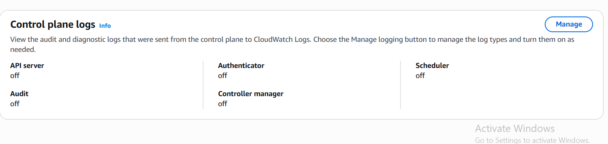

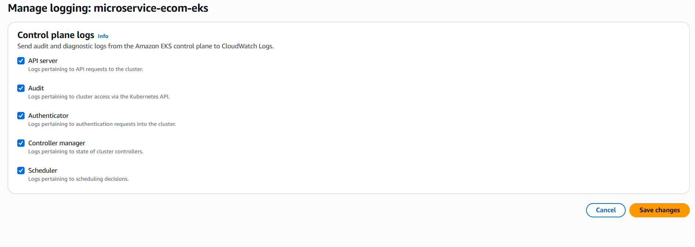

View the logs in cloud watch.

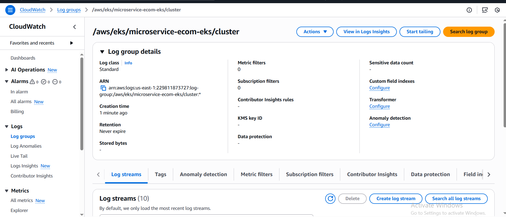

You can also check logs insight in the cloud watch and query as per your need.

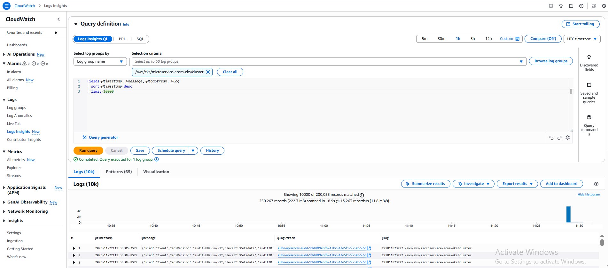

## **POD Logging**

The Kubernetes logging architecture defines three distinct levels:

- Basic level logging: the ability to grab pods log using kubectl (e.g. `kubectl logs myapp` – where `myapp` is a pod running in my cluster)
- Node level logging: The container engine captures logs from the application’s `stdout` and `stderr`, and writes them to a log file.
- Cluster level logging: Building upon node level logging; a log capturing agent runs on each node. The agent collects logs on the local filesystem and sends them to a centralized logging destination like Elasticsearch or CloudWatch. The agent collects two types of logs:
    - Container logs captured by the container engine on the node.
    - System logs.

Kubernetes, by itself, doesn’t provide a native solution to collect and store logs. It configures the container runtime to save logs in JSON format on the local filesystem. Container runtime – like Docker – redirects container’s stdout and stderr streams to a logging driver. In Kubernetes, container logs are written to `/var/log/pods/*.log` on the node. Kubelet and container runtime write their own logs to `/var/logs` or to journald, in operating systems with systemd. Then cluster-wide log collector systems like Fluentd can tail these log files on the node and ship logs for retention. These log collector systems usually run as DaemonSets on worker nodes.

For Kubernetes cluster components that run in pods, these write to files inside the `/var/log` directory, bypassing the default logging mechanism. We can implement pod-level logging by deploying a node-level logging agent as a DaemonSet on each node, such as Fluent Bit.

Fluent Bit is a lightweight log processor and forwarder that allows you to collect data and logs from different sources, enrich them with filters and send them to multiple destinations like CloudWatch, Kinesis Data Firehose, Kinesis Data Streams and Amazon OpenSearch Service.

AWS provides a Fluent Bit image with plugins for both CloudWatch Logs and Kinesis Data Firehose. The AWS for Fluent Bit image is available on the Amazon ECR Public Gallery.

Fluent Bit can be used to ship logs to various destinations. We will see how it is leveraged to ship the container logs to CloudWatch.

This setup is for: **Collecting ALL logs from your EKS nodes + pods and sending them to CloudWatch Logs**

Fluent Bit runs as a **DaemonSet**, meaning:

👉 **One Fluent Bit pod runs on every node** (Linux or Windows)

👉 These pods read logs from each node

👉 Then ship them to CloudWatch under these log groups:

| Log Group | Contains |
| --- | --- |
| `/aws/containerinsights/<Cluster>/application` | Logs of **your containers** (`/var/log/containers`) |
| `/aws/containerinsights/<Cluster>/host` | Logs from the **node OS** (`/var/log/dmesg`, `/var/log/messages`, etc.) |
| `/aws/containerinsights/<Cluster>/dataplane` | **Kubernetes components logs** (kubelet, kube-proxy, container runtime journal logs) |

<aside>
💡

# Why Fluent Bit?

Fluent Bit is:

- Lightweight
- Fast
- Recommended by AWS
- Works with Docker and containerd

AWS replaced FluentD with Fluent Bit because FluentD has performance issues on containerd-based nodes.

</aside>

**Create namespace `amazon-cloudwatch`**

All Fluent Bit resources live inside this namespace.

```bash
kubectl apply -f https://raw.githubusercontent.com/aws-samples/amazon-cloudwatch-container-insights/latest/k8s-deployment-manifest-templates/deployment-mode/daemonset/container-insights-monitoring/cloudwatch-namespace.yaml
```

**Create ConfigMap `fluent-bit-cluster-info`**

This provides Fluent Bit with:

- Your cluster name
- AWS region
- Whether to read logs from beginning or tail
- Whether to expose HTTP metrics

So Fluent Bit knows:

✔️ where the logs will be sent

✔️ how to read logs

✔️ how to expose metrics

```bash
ClusterName=microservice-ecom-eks
RegionName=us-east-1
FluentBitHttpPort='2020'
FluentBitReadFromHead='Off'
[[ ${FluentBitReadFromHead} = 'On' ]] && FluentBitReadFromTail='Off'|| FluentBitReadFromTail='On'
[[ -z ${FluentBitHttpPort} ]] && FluentBitHttpServer='Off' || FluentBitHttpServer='On'
kubectl create configmap fluent-bit-cluster-info \
--from-literal=cluster.name=${ClusterName} \
--from-literal=http.server=${FluentBitHttpServer} \
--from-literal=http.port=${FluentBitHttpPort} \
--from-literal=read.head=${FluentBitReadFromHead} \
--from-literal=read.tail=${FluentBitReadFromTail} \
--from-literal=logs.region=${RegionName} -n amazon-cloudwatch
```

**Create IAM Policy for Fluent Bit**

Create a file named `fluentbit-policy.json`:

```json
{
  "Version": "2012-10-17",
  "Statement": [
    {
      "Effect": "Allow",
      "Action": [
        "logs:CreateLogGroup",
        "logs:CreateLogStream",
        "logs:PutLogEvents",
        "logs:DescribeLogStreams"
      ],
      "Resource": "*"
    }
  ]
}
```

Create the policy:

```bash
aws iam create-policy \
  --policy-name FluentBit-CloudWatch-Policy \
  --policy-document file://fluentbit-policy.json
```

Copy the ARN from the output.

(It will look like: `arn:aws:iam::<ACCOUNT_ID>:policy/FluentBit-CloudWatch-Policy`)

---

**Create IRSA ServiceAccount for Fluent Bit**

**Important:** Fluent Bit runs in **namespace `amazon-cloudwatch`** and the ServiceAccount name is **fluent-bit**.

Run:

```bash
eksctl create iamserviceaccount \
  --name fluent-bit \
  --namespace amazon-cloudwatch \
  --cluster $CLUSTER_NAME \
  --region $AWS_REGION \
  --attach-policy-arn arn:aws:iam::$AWS_ACCOUNT:policy/FluentBit-CloudWatch-Policy \
  --approve
```

This command creates:

✔ IAM role

✔ OIDC trust

✔ ServiceAccount with annotation

✔ CloudFormation stack

✔ All IRSA wiring

**Apply Fluent Bit DaemonSet**

This is the main part.

### This DaemonSet installs Fluent Bit on **every node**

→ that’s how logs from all nodes & pods are collected.

```bash
kubectl apply -f https://raw.githubusercontent.com/aws-samples/amazon-cloudwatch-container-insights/latest/k8s-deployment-manifest-templates/deployment-mode/daemonset/container-insights-monitoring/fluent-bit/fluent-bit.yaml
```

Validate the deployment

```bash
kubectl get pods -n amazon-cloudwatch
```

It installs a **DaemonSet** so **one Fluent Bit pod runs on each node** and sends:

- **Application logs** → `/aws/containerinsights/<cluster>/application`
- **Host OS logs** → `/aws/containerinsights/<cluster>/host`
- **Kubernetes dataplane logs** → `/aws/containerinsights/<cluster>/dataplane`

This gives full EKS logging into CloudWatch.

**What resources it creates**

✔️ **ServiceAccount: `fluent-bit`**

Used by Fluent Bit pods to authenticate with AWS (IAM/IRSA).

✔️ **ClusterRole: `fluent-bit-role`**

Gives Fluent Bit read access to pod metadata in Kubernetes.

✔️ **ConfigMap: `fluent-bit-config`**

Contains the logging config (inputs, filters, CloudWatch outputs).

The ConfigMap for aws-for-fluent-bit is configured to stream the contents of files in the directory `/var/log/containers/*.log` from each node to the CloudWatch log group `/eks-workshop/worker-fluentbit-logs`:

```bash
kubectl describe configmap -n amazon-cloudwatch fluent-bit-config
```

Use the `kubectl logs` command to check the Fluent Bit Pod logs, where you will observe new CloudWatch Log groups and streams are created for the services.

```bash
kubectl logs daemonset.apps/fluent-bit -n amazon-cloudwatch

```

**Verify the Fluent Bit setup**

Open Cloudwatch, Choose Log groups

You should see these log groups:

- `/aws/containerinsights/<cluster>/application`
- `/aws/containerinsights/<cluster>/host`
- `/aws/containerinsights/<cluster>/dataplane`

If they have recent logs → Fluent Bit is working.

AWS creates log groups **only when the first log event is received**. So if it doesn’t create quickly wait for some time.

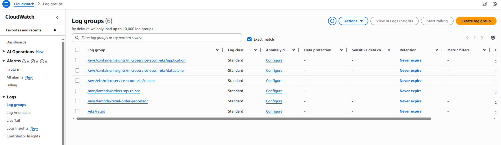

## SSL/TLS for the UI (Added in the previous tab)

As of now we can access our app through http , now its  time to add TLS. and SSL redirect so that we can access our app with https. add the below annotations to the ingress.

I am using `alb.ingress.kubernetes.io/group.name`  for multi ingress setup. so that we can expose our prometheus and grafana using the same ALB.

```bash
ingress:
  enabled: true
  className: "alb"
  annotations:
    alb.ingress.kubernetes.io/scheme: internet-facing
    alb.ingress.kubernetes.io/target-type: ip
    alb.ingress.kubernetes.io/healthcheck-path: /actuator/health/liveness
    alb.ingress.kubernetes.io/certificate-arn: arn:aws:acm:us-east-1:229811873727:certificate/2803e9ed-f705-4a08-a070-a5a523da7f28
    alb.ingress.kubernetes.io/group.name: ecom-eks
    alb.ingress.kubernetes.io/backend-protocol: HTTP
     alb.ingress.kubernetes.io/listen-ports: '[{"HTTP":80}, {"HTTPS":443}]'
     alb.ingress.kubernetes.io/ssl-redirect: '443'

```

Save and re upgrade the helm chart.

```bash
helm upgrade -i ui oci://public.ecr.aws/aws-containers/retail-store-sample-ui-chart --version 1.3.0 -f ui-values-def.yaml
```

# Monitoring

### Install Prometheus + Grafana (kube-prometheus-stack)

```bash
helm repo add prometheus-community https://prometheus-community.github.io/helm-charts
helm repo update
helm install prometheus-stack prometheus-community/kube-prometheus-stack --version 79.7.1 -n monitoring --create-namespace
```

Prometheus scrapes metrics from node exporters, Kubernetes components, and any Envoy metrics that you expose.

---

```bash
kubectl get po -n monitoring

NAME                                                     READY   STATUS    RESTARTS   AGE
alertmanager-prometheus-stack-kube-prom-alertmanager-0   2/2     Running   0          21s
prometheus-prometheus-stack-kube-prom-prometheus-0       2/2     Running   0          20s
prometheus-stack-grafana-57b9f6c5d4-v9pf4                2/3     Running   0          24s
prometheus-stack-kube-prom-operator-5c57fb45c7-q7qm4     1/1     Running   0          24s
prometheus-stack-kube-state-metrics-59d55c4c-k4xxg       1/1     Running   0          24s
prometheus-stack-prometheus-node-exporter-8z26f          1/1     Running   0          24s
prometheus-stack-prometheus-node-exporter-bv87t          1/1     Running   0          24s
prometheus-stack-prometheus-node-exporter-frqvt          1/1     Running   0          24s

```

Now let’s expose Prometheus and Grafana using an ALB and map them to our domain.

```bash
helm show values prometheus-community/kube-prometheus-stack --version 79.7.1 > prometheus-values-79.7.1.yaml
```

<aside>
💡

```
 annotations:
      alb.ingress.kubernetes.io/scheme: internet-facing
      alb.ingress.kubernetes.io/certificate-arn: arn:aws:acm:us-east-1:229811873727:certificate/2803e9ed-f705-4a08-a070-a5a523da7f28
      alb.ingress.kubernetes.io/group.name: ecom-eks
      alb.ingress.kubernetes.io/target-type: ip
      alb.ingress.kubernetes.io/backend-protocol: HTTP
      alb.ingress.kubernetes.io/listen-ports: '[{"HTTP":80}, {"HTTPS":443}]'
      alb.ingress.kubernetes.io/ssl-redirect: '443'
```

### **🔍 ALB Ingress Annotations Explained**

### **1. `alb.ingress.kubernetes.io/scheme: internet-facing`**

- This tells AWS to create an **internet-facing ALB**.
- The ALB will get a **public IP** and be accessible from the internet.
- If set to `internal`, it would only be reachable inside the VPC.

---

### **2. `alb.ingress.kubernetes.io/certificate-arn: <ACM-ARN>`**

- Associates your **ACM SSL certificate** with the ALB.
- Enables **HTTPS (TLS) termination** at the ALB.

---

### **3. `alb.ingress.kubernetes.io/group.name: ecom-eks`**

- Places this ingress in a **shared ALB group** called `ecom-eks`.
- Multiple ingresses with the same group name will **share the same ALB**.
- Useful when:
    - You want **one ALB for multiple apps**
    - Each app uses different paths or hostnames

---

### **4. `alb.ingress.kubernetes.io/target-type: ip`**

- Sends traffic directly to **pod IPs** instead of node ports.
- Recommended for EKS because:
    - It avoids using NodePort Services
    - Works better with dynamic pods
    - Supports multi-AZ properly

---

### **5. `alb.ingress.kubernetes.io/backend-protocol: HTTP`**

- Tells the ALB to forward traffic to backend pods using **HTTP**.
- Even if the user connects via HTTPS, internal traffic remains HTTP (common pattern).
- TLS is terminated at the ALB.

---

### **6. `alb.ingress.kubernetes.io/listen-ports: '[{"HTTP":80}, {"HTTPS":443}]'`**

- Configures the ALB to listen on:
    - **Port 80** for HTTP
    - **Port 443** for HTTPS
- Required if you want both HTTP → HTTPS redirect and proper TLS handling.

---

### **7. `alb.ingress.kubernetes.io/ssl-redirect: '443'`**

- Automatically redirects all HTTP traffic (port 80) to **HTTPS (port 443)**.
- Improves security and enforces encrypted communication.
</aside>

Update the values file and include the following under the Grafana section.

```bash
ingress:
    ## If true, Grafana Ingress will be created
    ##
    enabled: true

    ## IngressClassName for Grafana Ingress.
    ## Should be provided if Ingress is enable.
    ##
    ingressClassName: alb

    ## Annotations for Grafana Ingress
    ##
    annotations:
      alb.ingress.kubernetes.io/scheme: internet-facing
      alb.ingress.kubernetes.io/certificate-arn: arn:aws:acm:us-east-1:229811873727:certificate/2803e9ed-f705-4a08-a070-a5a523da7f28
      alb.ingress.kubernetes.io/group.name: ecom-eks
      alb.ingress.kubernetes.io/target-type: ip
      alb.ingress.kubernetes.io/backend-protocol: HTTP
      alb.ingress.kubernetes.io/listen-ports: '[{"HTTP":80}, {"HTTPS":443}]'
      alb.ingress.kubernetes.io/ssl-redirect: '443'
      # kubernetes.io/ingress.class: nginx
      # kubernetes.io/tls-acme: "true"

    ## Labels to be added to the Ingress
    ##
    labels: {}

    ## Hostnames.
    ## Must be provided if Ingress is enable.
    ##
    # hosts:
    #   - grafana.domain.com
    hosts:
      - grafana.devopsdock.site

```

**For prometheus:**

```bash
ingress:
    enabled: true

    ingressClassName: "alb"

    annotations:
      alb.ingress.kubernetes.io/scheme: internet-facing
      alb.ingress.kubernetes.io/certificate-arn: arn:aws:acm:us-east-1:229811873727:certificate/2803e9ed-f705-4a08-a070-a5a523da7f28
      alb.ingress.kubernetes.io/group.name: ecom-eks
      alb.ingress.kubernetes.io/target-type: ip
      alb.ingress.kubernetes.io/backend-protocol: HTTP
      alb.ingress.kubernetes.io/listen-ports: '[{"HTTP":80}, {"HTTPS":443}]'
      alb.ingress.kubernetes.io/ssl-redirect: '443'
    labels: {}

    ## Redirect ingress to an additional defined port on the service
    # servicePort: 8081

    ## Hostnames.
    ## Must be provided if Ingress is enabled.
    ##
    # hosts:
    #   - prometheus.domain.com
    hosts:
      - prometheus.devopsdock.site

    ## Paths to use for ingress rules - one path should match the prometheusSpec.routePrefix
    ##
    paths:
    - /

    ## For Kubernetes >= 1.18 you should specify the pathType (determines how Ingress paths should be matched)
    ## See https://kubernetes.io/blog/2020/04/02/improvements-to-the-ingress-api-in-kubernetes-1.18/#better-path-matching-with-path-types
    pathType: Prefix

```

Deploy:

```bash
helm upgrade prometheus-stack prometheus-community/kube-prometheus-stack -f helm-values/prometheus-values-79.7.1.yaml --version 79.7.1
```

When you check the ALB, the HTTPS listener (port 443) will now show **four rules**:

- One rule for the **UI application**
- One for **Prometheus**
- One for **Grafana**
- And one **default rule** used when no other rule matches

Additionally, for each of these services, the HTTP listener (port 80) is configured to **redirect all incoming HTTP traffic to HTTPS**, ensuring secure access.

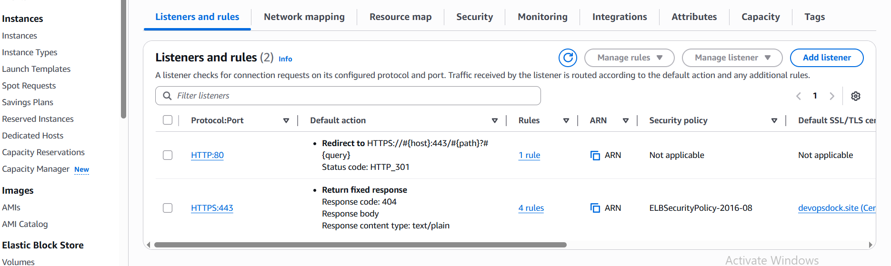

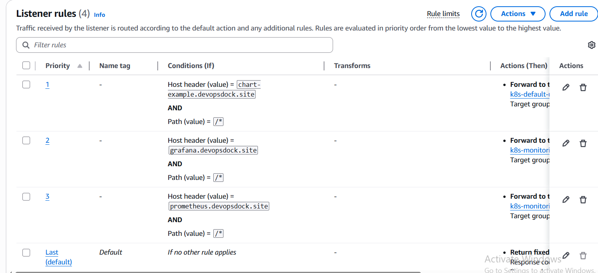

Now update the Route 53 records for the UI app, Prometheus, and Grafana.

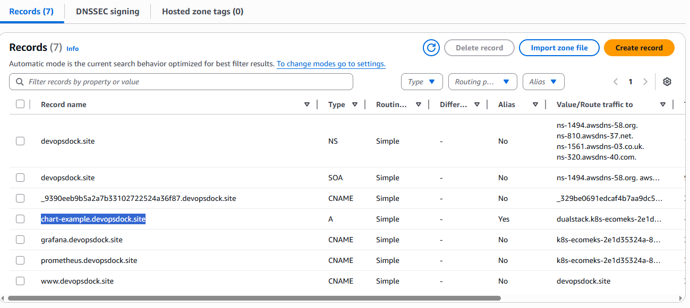

Retrieve your Grafana admin password:

```bash
kubectl get secret --namespace monitoring -l app.kubernetes.io/component=admin-secret -o jsonpath="{.items[0].data.admin-password}" | base64 --decode ; echo
```

**Access the dashboards:**

```bash
https://grafana.devopsdock.site/
https://prometheus.devopsdock.site/
```

**Some Screenshots:**


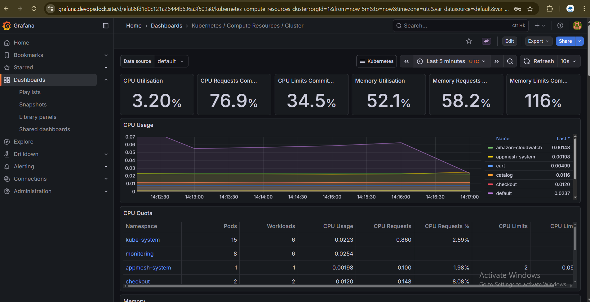

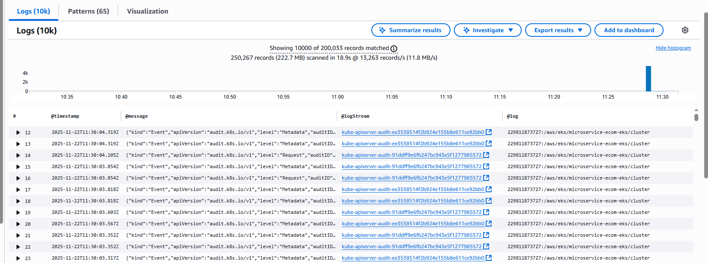

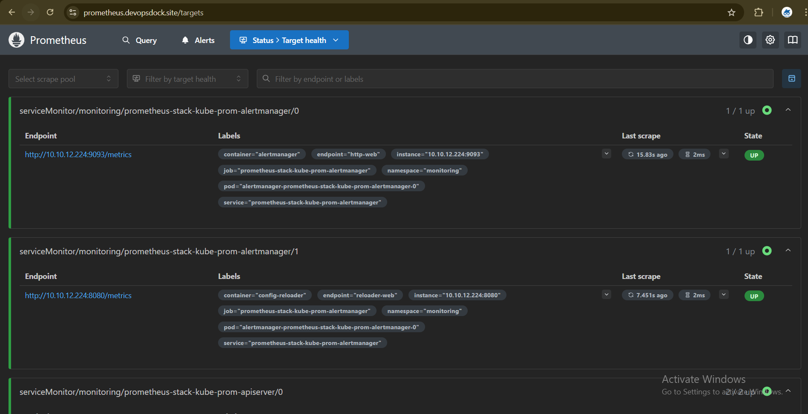

# **CLEAN UP**

To remove the EKS cluster:

```bash
eksctl delete cluster --name microservice-ecom-eks
```

After deleting the cluster, make sure to manually clean up the remaining AWS resources:

- **CloudWatch Log Groups**
- **SQS Queues**
- **DynamoDB Tables**
- **Lambda Functions**
- **SNS Topics**
- **VPC and all associated components**
    
    (subnets, route tables, IGW, NAT gateways, security groups, etc.)
    

---
