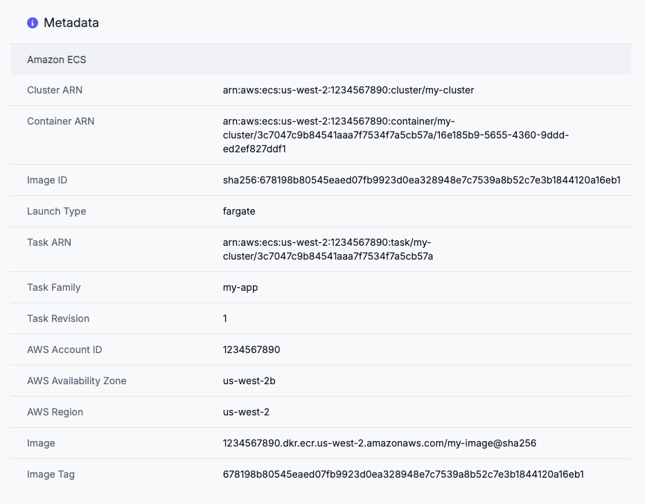
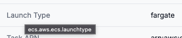
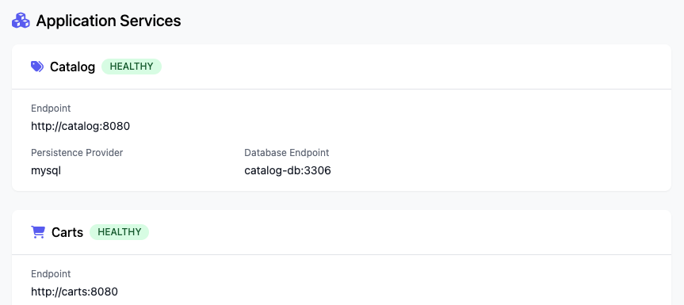
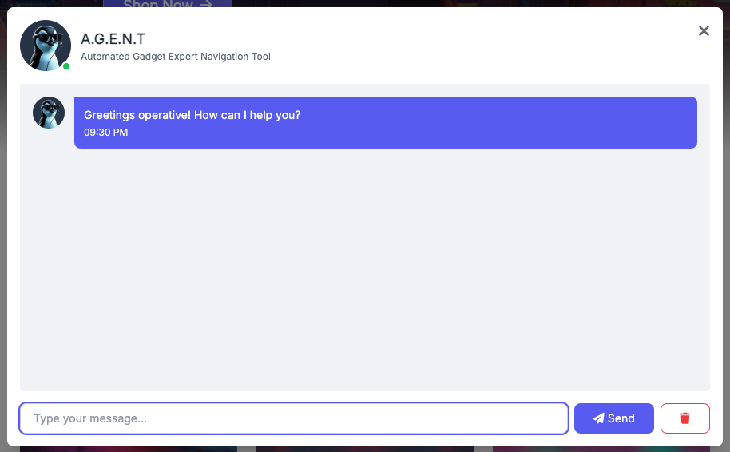

# AWS Containers Retail Sample - UI Service

| Language | Persistence |
| -------- | ----------- |
| Java     | N/A         |

This service provides the frontend for the retail store, serving the HTML UI and aggregating calls to the backend API components.

## Features

The UI component offers several features outside of its functionality as a component within the store architecture.

### Theming

The primary color of the UI can be changed via configuration values, which is useful to provide a distinct appearance.

This is the default theme:


This is an alternative theme:


The theme can be changed in two ways:

1. Set the `RETAIL_UI_THEME` environment variable
2. Append `?theme=<name>` to any URL in the UI. This will set a cookie that persists the theme between page reloads.

See the configuration section below for valid values for the theme.

### Introspection information

This is a page that displays information about the environment the container is deployed in. This is useful for demonstrations where it is necessary to show aspects such as cross-AZ load balancing and many others.

The implementation includes metadata for Kubernetes, Amazon EC2, Amazon ECS and AWS Lambda.

This example shows a container running in Amazon ECS:



The page can be found at `/info`.

To highlight specific attributes you add their names to the URL. For example `/info?attr=ecs.cloud.region,ecs.cloud.availability_zone,ecs.cloud.account.id`:


You can find the attribute IDs by hovering your cursor over the relevant attribute name in the table:



### Application topology

This is a page that displays information about the application topology thats been deployed. For example it shows what components are deployed, their health and information about their configured dependencies like databases.



The page can be found at `/topology`.

### Generative AI chat bot

This feature provides a chat bot interface directly in the store UI which can be used to demonstrate basic LLM inference use-cases. It is works with Amazon Bedrock and OpenAI compatible endpoints via configuration properties.



The chat bot is disabled by default, and can be enabled by setting the environment variable `RETAIL_UI_CHAT_ENABLED=true`. This will enable the following button to display on the botton-right area of the UI:


You must also configure one of the below providers.

#### Mock provider

This is designed for quick testing and can be enabled by setting `RETAIL_UI_CHAT_PROVIDER=mock`.

#### Amazon Bedrock

This provides integration with Amazon Bedrock, the example below shows the relevant configuration values as environment variables:

```bash
RETAIL_UI_CHAT_PROVIDER=bedrock # Use Amazon Bedrock
RETAIL_UI_CHAT_MODEL=anthropic.claude-3-5-sonnet-20241022-v2:0 # Provide Bedrock model ID
RETAIL_UI_CHAT_BEDROCK_REGION=us-west-2 # Configure the region to use for Bedrock API calls
```

#### OpenAI endpoint

This provides integration with any OpenAI-compatible endpoint, the example below shows the relevant configuration values as environment variables:

```bash
RETAIL_UI_CHAT_PROVIDER=openai # Use an OpenAPI compatible endpoint
RETAIL_UI_CHAT_MODEL=meta-llama/Meta-Llama-3.1-8B # Provide a model ID
RETAIL_UI_CHAT_OPENAI_BASEURL=http://localhost:8000 # (Optional) Base URL for the OpenAI API, usually for self-hosted LLMs
RETAIL_UI_CHAT_OPENAI_APIKEY=<YOUR API KEY> # (Optional) API key for the OpenAPI endpoint
```

## Configuration

The following environment variables are available for configuring the service:

| Name                                 | Description                                                                    | Default     |
| ------------------------------------ | ------------------------------------------------------------------------------ | ----------- |
| `PORT`                               | The port which the server will listen on                                       | `8080`      |
| `RETAIL_UI_THEME`                    | Name of the theme for the UI, valid values are `default`, `green`, `orange`    | `"default"` |
| `RETAIL_UI_DISABLE_DEMO_WARNINGS`    | Disable the UI messages warning about demonstration content                    | `false`     |
| `RETAIL_UI_ENDPOINTS_CATALOG`        | The endpoint of the catalog API. If set to `false` uses a mock implementation  | `false`     |
| `RETAIL_UI_ENDPOINTS_CARTS`          | The endpoint of the carts API. If set to `false` uses a mock implementation    | `false`     |
| `RETAIL_UI_ENDPOINTS_ORDERS`         | The endpoint of the orders API. If set to `false` uses a mock implementation   | `false`     |
| `RETAIL_UI_ENDPOINTS_CHECKOUT`       | The endpoint of the checkout API. If set to `false` uses a mock implementation | `false`     |
| `RETAIL_UI_ENDPOINTS_HTTP_KEEPALIVE` | Set to false to disable HTTP keepalive on requests to backend services         | `true`      |

## Endpoints

Several "utility" endpoints are provided with useful functionality for various scenarios:

| Method | Name                           | Description                                                                 |
| ------ | ------------------------------ | --------------------------------------------------------------------------- |
| `GET`  | `/utility/status/{code}`       | Returns HTTP response with given HTTP status code                           |
| `GET`  | `/utility/headers`             | Print the HTTP headers of the inbound request                               |
| `GET`  | `/utility/panic`               | Shutdown the application with an error code                                 |
| `POST` | `/utility/echo`                | Write back the POST payload sent                                            |
| `POST` | `/utility/store`               | Write the payload to a file and return a hash                               |
| `GET`  | `/utility/store/{hash}`        | Return the payload from the file system previously written                  |
| `GET`  | `/utility/stress/{iterations}` | Stress the CPU with the number of iterations increasing the CPU consumption |

## Running

There are two main options for running the service:

### Local

Pre-requisites:

- Java 21 installed

Run the Spring Boot application like so:

```
./mvnw spring-boot:run
```

Test the application by visiting `http://localhost:8080` in a web browser.

### Docker

A `docker-compose.yml` file is included to run the service in Docker:

```
docker compose up
```

Test the application by visiting `http://localhost:8080` in a web browser.

To clean up:

```
docker compose down
```
